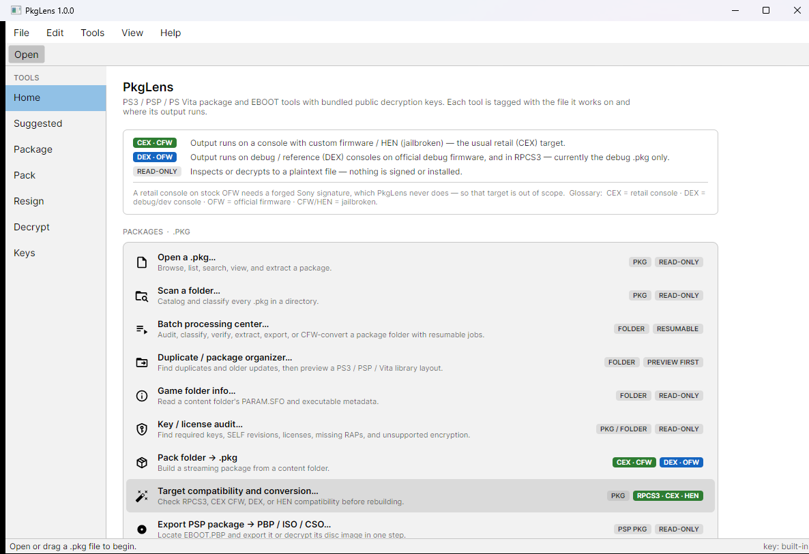

# PkgLens

PkgLens is a cross-platform GUI and CLI for inspecting, extracting, decrypting, converting,
rebuilding, and verifying PS3, PSP, and PS Vita packages. It also handles protected content,
executables, disc exports, and PSARC archives.

> **Output compatibility depends on the profile.** Rebuilt packages and unsigned/fake-signed SELF
> output target RPCS3 or patched loaders. Verified legacy SELF header signing is available for a
> limited set of older keys; stock retail and DEX bootability are not guaranteed. See [Scope](#scope).

See the complete [`PkgLens feature list`](docs/features.md).



## Highlights

- Inspect package metadata, files, `PARAM.SFO`, SELF/EBOOT/SPRX headers, content IDs, and firmware
  requirements.
- Extract, replace, compare, build, repack, verify, and target-convert PS3 packages for RPCS3, CEX CFW,
  or HEN.
- [Finalize existing debug PS3 packages](docs/finalize-package.md) into verified retail-encrypted
  copies while preserving their files and executable signatures.
- Decrypt EDAT/SDAT and SELF/EBOOT content, resolve RAPs automatically, fake-sign executables, and apply
  supported firmware patches.
- Encrypt and rebuild EDAT/SDAT, preview verified plaintext, and stage rebuilt files in packages.
  See [EDAT / SDAT tools](docs/edat-tools.md).
- Build encrypted NON-DRM (APP) or NPDRM SELF/EBOOT/SPRX files, including rebuilding existing
  executables with independent input/output keys and verified legacy signing profiles.
  See [SELF building](docs/self-building.md).
- Export PS1 Classics, PS2 Classics, PSP packages (`EBOOT.PBP`, ISO, or CSO), and structured Vita content.
- Browse and rebuild zlib or LZMA PSARC archives while preserving their compression.
- Audit keys/licenses, match base/update/DLC packages, find duplicates, organize libraries, and run
  resumable batch jobs.
- Preflight risky operations and verify rebuilt PKGs, EDATs, ISOs/CSOs, PSARCs, and fake-signed SELFs
  before reporting success.

The GUI exposes these workflows through **Suggested**, **File**, and **Tools**. Eligibility checks hide
or disable operations that do not apply to the selected package.

## Quick start

```
dotnet run --project src/PkgLens.Gui
dotnet run --project src/PkgLens.Cli -- info <pkg>
```

On Windows, `run-gui.cmd` builds and launches the app. `publish-gui.cmd` creates
`dist\pkglens.gui.exe` and a Desktop shortcut. Open or drag in a `.pkg` or `.psarc`; the **Suggested**
page shows the operations that apply to that file.

## CLI

```
pkglens --help
pkglens info <pkg> [--json]
pkglens extract <pkg> [--out DIR]
pkglens verify <pkg> [--json]
pkglens audit <pkg|file|folder> [--json]
```

Run `pkglens <command> --help` for full options. Commands support structured `--json` output where
applicable. The GUI is the recommended interface and exposes nearly every workflow.

## Keys

Standard PS3, IDU/kiosk, PSP/PSX, and Vita package keys are bundled and selected automatically.
Licensed EDAT/EBOOT content may still require your RAP or a content-specific klicensee; PkgLens
automatically checks a bundled known-key catalog before asking for one. The GUI also manages RAPs
and a local, auto-resolving klicensee database. Vita content may require `work.bin`/RIF material.
See [`docs/keys.md`](docs/keys.md).

## Scope

Use PkgLens only with content you own. It contains publicly documented decryption keys and a limited
set of published legacy APP/NPDRM signing keys, with no per-console IDPS/EID secrets. Legacy signing
verifies the SELF header signature; it does not sign PKGs or NPDRM footers, provide modern signing
keys, or establish stock retail/DEX/OFW compatibility. Rebuilt packages and unsigned or fake-signed
executables still target RPCS3 or patched loaders.

## Development

```powershell
dotnet build
dotnet test
```

Run CI manually from **Actions > CI > Run workflow** to perform tests, vulnerability auditing, and
coverage enforcement. It does not run automatically on pushes or pull requests. Enable
**Upload test, coverage, and dependency audit reports** when downloadable reports are needed;
these artifacts are retained for three days.

The release version is stored in `Directory.Build.props`. After updating and committing it, push a
matching tag such as `v1.0.0` to create a GitHub release with self-contained GUI and CLI archives for
Windows x64, Linux x64, macOS Intel, and macOS Apple Silicon. Archive and executable names include
the version, such as `PkgLens-1.0.0.exe`.
Temporary workflow artifacts are retained for one day; the archives attached to the GitHub release
remain available.
